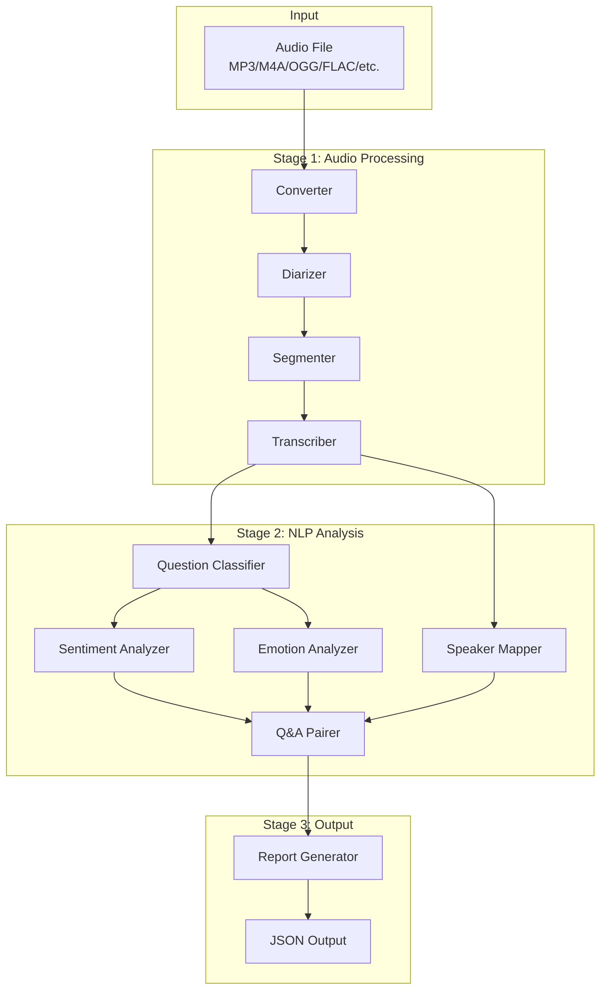
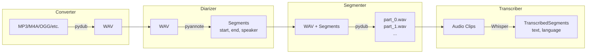
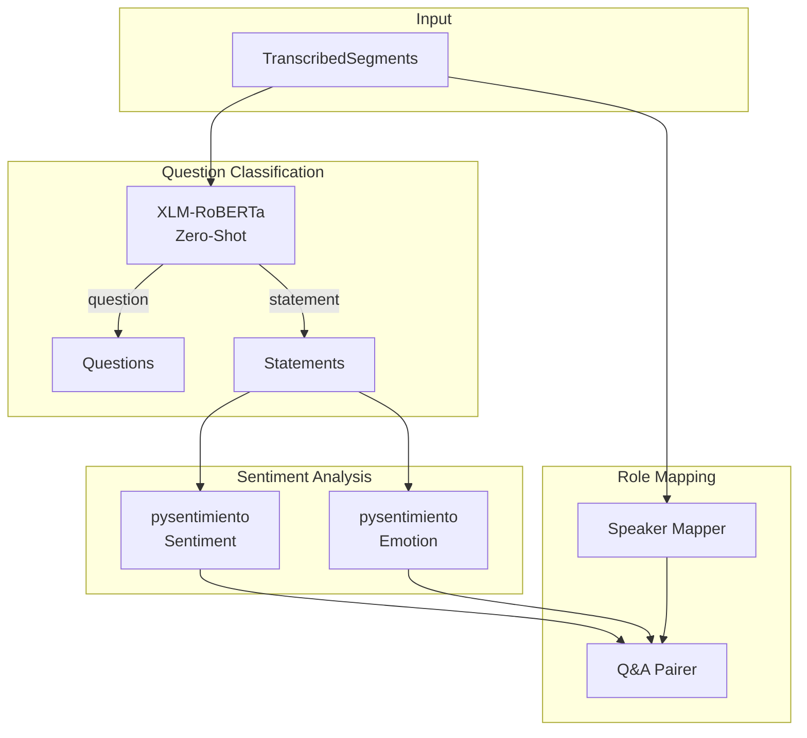
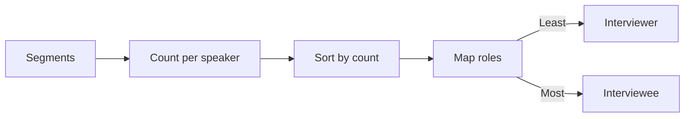
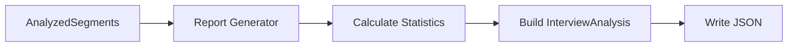
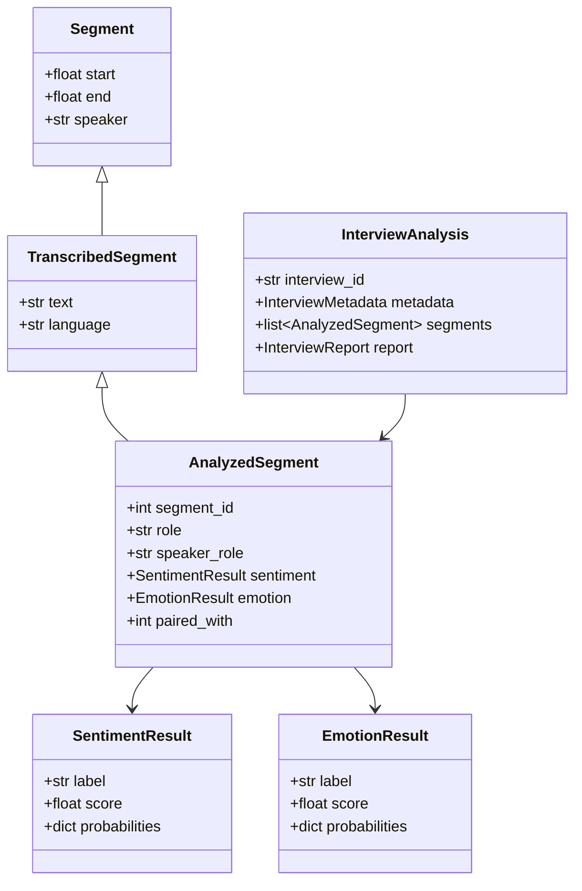
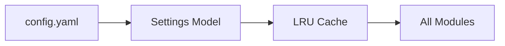
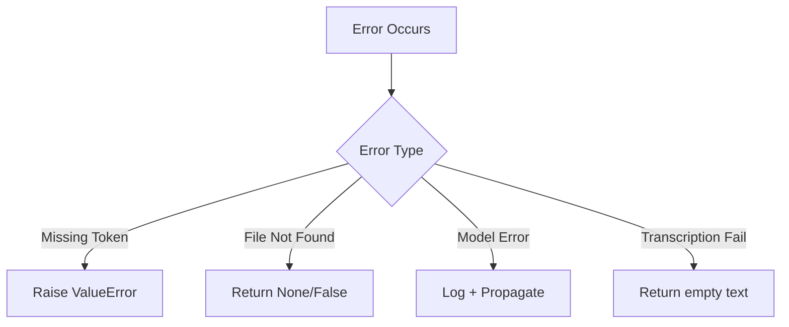

# Architecture Documentation

Technical documentation explaining how the Interview Sentiment Analyzer works internally.

## Project Structure

The codebase follows a **domain-driven namespace structure** where each module groups related functionality by responsibility.

```
src/
├── audio/          # Stage 1: Audio processing (input → transcribed text)
├── analysis/       # Stage 2: NLP analysis (text → insights)
├── output/         # Stage 3: Report generation (insights → JSON)
├── pipeline/       # Orchestration (coordinates all stages)
├── models/         # Data structures (shared across all stages)
├── config/         # Configuration & environment setup
└── utils/          # Cross-cutting utilities
```

### Namespace Logic

| Namespace | Responsibility | When to look here |
|-----------|---------------|-------------------|
| `src.audio` | Transform audio files into text | Adding audio formats, changing transcription |
| `src.analysis` | Extract meaning from text | Adding new NLP tasks, changing classifiers |
| `src.output` | Generate final deliverables | Changing report format, adding export types |
| `src.pipeline` | Coordinate execution flow | Changing step order, adding/removing stages |
| `src.models` | Define data contracts | Adding fields to outputs, creating new entities |
| `src.config` | Manage settings & paths | Adding config options, changing defaults |
| `src.utils` | Reusable helpers | Progress display, file cleanup |

### File Reference

#### `src/audio/` — Audio Processing

| File | Purpose | Key Function |
|------|---------|--------------|
| `converter.py` | Any audio format → WAV | `ensure_wav_audio()`, `find_audio_file()` |
| `diarizer.py` | Detect who speaks when | `diarize_audio()` |
| `segmenter.py` | Split audio by speaker turns | `split_audio_segments()` |
| `transcriber.py` | Speech → text with Whisper | `transcribe_segments()` |

#### `src/analysis/` — NLP Analysis

| File | Purpose | Key Function |
|------|---------|--------------|
| `question_classifier.py` | Detect questions vs statements | `classify_question()` |
| `sentiment.py` | Sentiment + emotion analysis | `analyze_text()` |
| `speaker_mapper.py` | Assign interviewer/interviewee roles | `map_speakers()` |
| `qa_pairer.py` | Link questions to their answers | `pair_questions_answers()` |

#### `src/output/` — Output Generation

| File | Purpose | Key Function |
|------|---------|--------------|
| `report_generator.py` | Aggregate stats, build final report | `generate_report()`, `save_analysis()` |

#### `src/pipeline/` — Orchestration

| File | Purpose | Key Function |
|------|---------|--------------|
| `runner.py` | Execute all stages in order | `run_pipeline()` |

#### `src/models/` — Data Structures

| File | Purpose | Key Classes |
|------|---------|-------------|
| `segment.py` | Audio segment boundaries | `Segment`, `TranscribedSegment` |
| `analysis.py` | Analysis results | `SentimentResult`, `EmotionResult`, `AnalyzedSegment` |
| `interview.py` | Final output structure | `InterviewAnalysis`, `InterviewMetadata`, `InterviewReport` |

#### `src/config/` — Configuration

| File | Purpose | Key Function |
|------|---------|--------------|
| `settings.py` | Load & validate config.yaml | `get_settings()` |
| `paths.py` | Centralized path management | `get_project_paths()` |
| `environment.py` | Setup HuggingFace token, FFmpeg | `setup_environment()` |

#### `src/utils/` — Utilities

| File | Purpose | Key Function |
|------|---------|--------------|
| `cleanup.py` | Remove intermediate files | `cleanup_folders()` |
| `progress.py` | Terminal progress display | `pipeline_progress()` |

### Data Directory

```
data/
├── raw/            # Input: place audio files here (MP3, M4A, OGG, FLAC, etc.)
├── refined/        # Converted WAV audio (auto-generated, auto-cleaned)
├── interim/        # Temporary: RTTM diarization files (auto-cleaned)
└── output/         # Results: JSON analysis files, audio clips
```

---

## System Overview

The system is a multi-stage pipeline that transforms raw audio into structured sentiment analysis data. Each stage is independent and communicates through typed data models.



## Pipeline Stages

### Stage 1: Audio Processing



#### 1.1 Converter (`src/audio/converter.py`)

Finds and converts audio files to WAV format. Supports: MP3, M4A, MP4, OGG, FLAC, AAC, WMA, AIFF, WebM.

| Input | Output | Technology |
|-------|--------|------------|
| Any supported audio | WAV file in `data/refined/` | pydub |

#### 1.2 Diarizer (`src/audio/diarizer.py`)

Identifies speaker segments using neural speaker diarization.

| Input | Output | Technology |
|-------|--------|------------|
| WAV audio | List of `Segment` objects | pyannote.audio 3.1 |

**How it works:**
1. Loads audio with `torchaudio`
2. Runs pyannote speaker-diarization-3.1 pipeline
3. Extracts speaker turns with timestamps
4. Returns typed `Segment` objects

#### 1.3 Segmenter (`src/audio/segmenter.py`)

Splits the audio file into individual clips based on diarization.

| Input | Output | Technology |
|-------|--------|------------|
| WAV + Segments | Individual WAV clips | pydub |

#### 1.4 Transcriber (`src/audio/transcriber.py`)

Converts speech to text using OpenAI Whisper.

| Input | Output | Technology |
|-------|--------|------------|
| Audio clips | `TranscribedSegment` objects | openai-whisper |

**Language Detection:**
1. If `auto`, transcribes first clip without language hint
2. Whisper returns detected language code
3. Uses detected language for remaining clips

---

### Stage 2: NLP Analysis



#### 2.1 Question Classifier (`src/analysis/question_classifier.py`)

Classifies each utterance as a question or statement using zero-shot classification.

| Input | Output | Technology |
|-------|--------|------------|
| Text | Role + confidence | XLM-RoBERTa (100+ languages) |

**Model:** `joeddav/xlm-roberta-large-xnli`

**How it works:**
```python
classifier = pipeline("zero-shot-classification", model="joeddav/xlm-roberta-large-xnli")
result = classifier(text, candidate_labels=["question", "statement"])
# Returns: {'labels': ['question', 'statement'], 'scores': [0.92, 0.08]}
```

**Why zero-shot?**
- No training data needed
- Works with any language (100+)
- Handles mixed-language interviews
- Understands semantic intent (not just punctuation)

#### 2.2 Sentiment Analyzer (`src/analysis/sentiment.py`)

Analyzes sentiment polarity of statements.

| Input | Output | Technology |
|-------|--------|------------|
| Text + language | `SentimentResult` | pysentimiento |

**Labels:** `POS`, `NEG`, `NEU`

**How it works:**
```python
analyzer = create_analyzer(task="sentiment", lang="es")
result = analyzer.predict(text)
# AnalyzerOutput(output=POS, probas={POS: 0.85, NEG: 0.10, NEU: 0.05})
```

#### 2.3 Emotion Analyzer (`src/analysis/sentiment.py`)

Detects emotional content in statements.

| Input | Output | Technology |
|-------|--------|------------|
| Text + language | `EmotionResult` | pysentimiento |

**Labels:** `joy`, `anger`, `sadness`, `fear`, `disgust`, `surprise`, `others`

#### 2.4 Speaker Mapper (`src/analysis/speaker_mapper.py`)

Maps speaker codes to roles based on speaking frequency.

| Input | Output | Logic |
|-------|--------|-------|
| List of segments | Speaker → Role map | Least frequent = Interviewer |

**Assumption:** In interviews, the interviewer speaks less than the interviewee.



#### 2.5 Q&A Pairer (`src/analysis/qa_pairer.py`)

Links questions to their corresponding answers.

| Input | Output | Logic |
|-------|--------|-------|
| Analyzed segments | Segments with `paired_with` | Forward/backward search |

**Algorithm:**
1. For each question: find next segment from different speaker → that's the answer
2. For each statement: find previous question from different speaker → that's the question

---

### Stage 3: Output Generation



#### 3.1 Report Generator (`src/output/report_generator.py`)

Aggregates segment data into a comprehensive report.

**Calculations:**
- Sentiment distribution (count + percentage per label)
- Emotion distribution (count + percentage per label)
- Average sentiment score
- Dominant sentiment/emotion (most frequent)

---

## Data Models

All data flows through typed Pydantic models defined in `src/models/`.



---

## Configuration System



Settings are loaded once and cached. Each module accesses settings via `get_settings()`.

**Hierarchy:**
```
Settings
├── AudioSettings
│   ├── whisper_model: str
│   ├── sample_rate: int
│   └── min_segment_duration: float
├── AnalysisSettings
│   ├── question_model: str
│   └── default_language: str
├── ThresholdSettings
│   └── question_confidence: float
├── OutputSettings
│   ├── format: str
│   └── include_probabilities: bool
└── LoggingSettings
    └── level: str
```

---

## ML Models Used

| Task | Model | Size | Source |
|------|-------|------|--------|
| Speaker Diarization | pyannote/speaker-diarization-3.1 | ~100MB | HuggingFace |
| Transcription | openai/whisper-small | 244MB | OpenAI |
| Question Detection | joeddav/xlm-roberta-large-xnli | 1.1GB | HuggingFace |
| Sentiment Analysis | pysentimiento (BERTweet-based) | ~500MB | HuggingFace |
| Emotion Analysis | pysentimiento (BERTweet-based) | ~500MB | HuggingFace |

**Total model storage:** ~2.5GB (downloaded on first run)

---

## Error Handling



**Strategy:**
- Configuration errors: Fail fast with clear message
- I/O errors: Return None/False, let caller decide
- Model errors: Log and propagate (usually critical)
- Per-segment errors: Skip segment, continue pipeline

---

## Performance Considerations

### Model Caching

Models are loaded once and cached:

```python
@lru_cache(maxsize=4)
def _get_analyzer(task: str, lang: str):
    return create_analyzer(task=task, lang=lang)
```

### Batch Processing

Whisper processes clips sequentially but could be batched for GPU efficiency in future versions.

### Memory Usage

| Component | RAM Usage |
|-----------|-----------|
| pyannote pipeline | ~2GB |
| Whisper (small) | ~1GB |
| XLM-RoBERTa | ~2GB |
| pysentimiento | ~1GB |
| **Peak (concurrent)** | **~4GB** |

---

## Extension Points

### Adding a New Language

1. pysentimiento supports: `es`, `en`, `it`, `pt`
2. XLM-RoBERTa supports: 100+ languages
3. Whisper supports: 90+ languages

For new pysentimiento languages, fork and train custom models.

### Adding a New Analysis Type

1. Create module in `src/analysis/`
2. Add result model in `src/models/analysis.py`
3. Update `AnalyzedSegment` to include new field
4. Call from `src/pipeline/runner.py`
5. Include in report generation

### Custom Question Detection

Replace `question_model` in config with any HuggingFace zero-shot model:
```yaml
analysis:
  question_model: "facebook/bart-large-mnli"
```
